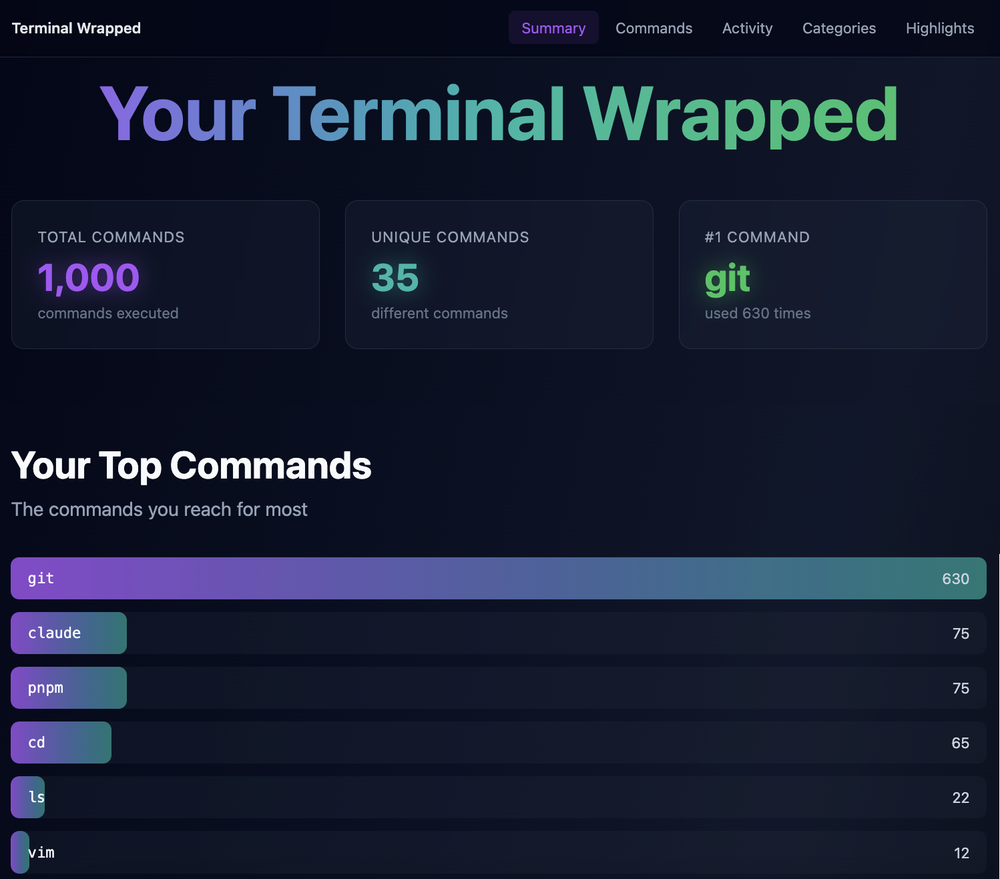

# Terminal Wrapped

Spotify Wrapped, but for your terminal. Analyze your shell history and get a beautiful, animated visualization of your command-line habits.



## Quick Start

```bash
# Install dependencies
pnpm install

# Build everything
pnpm build

# Run it (defaults to ~/.zsh_history)
pnpm cli:zsh
```

Your browser will open with an animated dashboard showing:
- Your most-used commands
- Favorite flags and options
- Activity patterns by hour
- Command categories breakdown
- **Your dirty little secrets** (exposed credentials in your history)
- Personalized highlights and achievements

## Other Shells

```bash
# Bash
pnpm cli -- ~/.bash_history

# Fish
pnpm cli -- ~/.local/share/fish/fish_history

# Any history file
pnpm cli -- /path/to/history
```

## Options

```bash
# Export stats as JSON instead of launching the UI
pnpm cli:zsh --json stats.json

# Filter by year
pnpm cli:zsh --year 2024

# Verbose output
pnpm cli:zsh --verbose

# See all options
pnpm cli:help
```

## What It Detects

- **Top Commands**: Your most-used commands ranked
- **Favorite Flags**: The options you reach for most (`-la`, `--verbose`, etc.)
- **Activity Patterns**: When you're most active in the terminal
- **Categories**: Git, Docker, navigation, file operations, and more
- **Secrets**: GitHub tokens, AWS keys, database URLs, and other credentials that shouldn't be in plain text (with appropriate shaming)

## Development

```bash
# Dev server for the web UI
pnpm dev:web

# Build CLI only
pnpm build:cli

# Build web only
pnpm build:web
```
